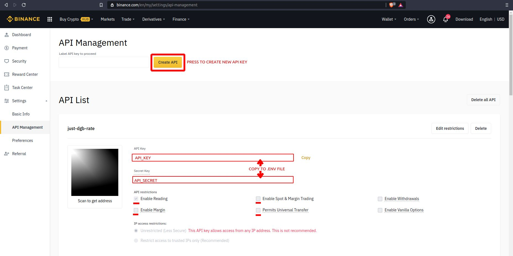

Download current DGB/USDT from Binance using API key
===

1. Download project using `git clone https://github.com/cept73/dgb-rate-to-file.git .` in some directory

2. Run `composer install`

3. Copy `.env.example` to `.env`

   
4. Open https://www.binance.com/en/my/settings/api-management and log in
   

5. Click "Create API" button

6. In `.env` file set `API Key` and `Secret key` using data on the site, also set filename to store last rate

7. Try to exec `php index.php`. Specified file might be created with rate in it

8. Using `/etc/cron` set it to run periodically to have rate in file always updated  
